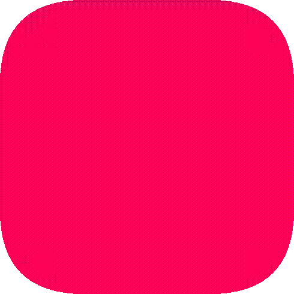
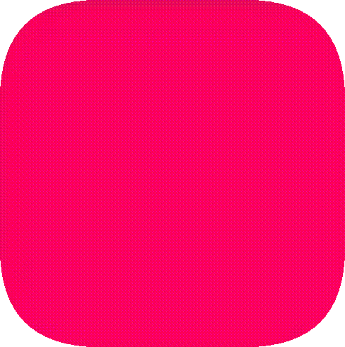
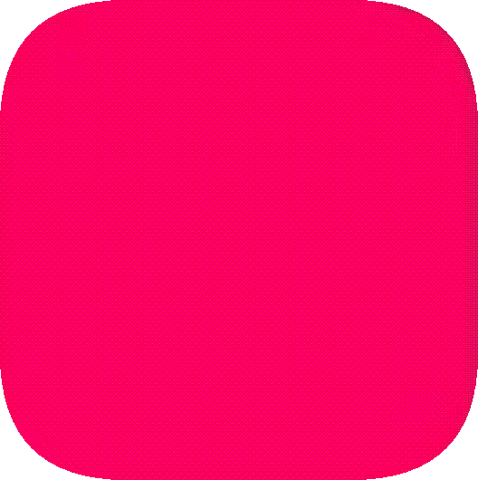

#### <a href = "https://github.com/CristianDavideConte/universalSmoothScroll#table-of-contents"><code>&#8678; Back to Table of Contents</code></a>
 

# Included easing functions (public use)
Method Name   | Visualization | Input parameters
:-----------: | :-----------: | :-------------
`CUSTOM_CUBIC_BEZIER` |   | The first 4 input parameters are the 4 points of the bézier curve and they determine the kind of easing obtained. 
`EASE_LINEAR` |   |
`EASE_IN_SINE` |   | 
`EASE_IN_QUAD` |   | 
`EASE_IN_CUBIC` |   | 
`EASE_IN_QUART` |   | 
`EASE_IN_QUINT` |   | 
`EASE_IN_EXPO` |   | 
`EASE_IN_CIRC` |   | 
`EASE_IN_BOUNCE` | There is a bouncing effect at the beginning of the scroll-animation, after that it's similar to the first part of `EASE_OUT_QUART`. |   | 
`EASE_OUT_SINE` |   | 
`EASE_OUT_QUAD` |   | 
`EASE_OUT_CUBIC` |   | 
`EASE_OUT_QUART` |   | 
`EASE_OUT_QUINT` |   | 
`EASE_OUT_EXPO` |   | 
`EASE_OUT_CIRC` |   | 
`EASE_OUT_BOUNCE` | The first quart of the animation it's similar to the last part of `EASE_IN_QUART`, after that there is a bouncing effect until the end of the scroll-animation. |   | 
`EASE_IN_OUT_SINE` |   | 
`EASE_IN_OUT_QUAD` |   | 
`EASE_IN_OUT_CUBIC` |   | 
`EASE_IN_OUT_QUART` |   | 
`EASE_IN_OUT_QUINT` |   | 
`EASE_IN_OUT_EXPO` |   | 
`EASE_IN_OUT_CIRC` |   | 
`EASE_IN_OUT_BOUNCE` | The first half of the animation it's the same as to the first part of `EASE_IN_BOUNCE`, the second one is the same as the last part of `EASE_OUT_BOUNCE`. |   | 
`EASE_ELASTIC_X` |  | Allows for an elastic easing effect on the x-axis of a container.   Takes in 4 parameters:   <ol> 1) A step length calculator which controls the easing of the **forward part** of the scroll-animation.   2) A step length calculator which controls the easing of the **backward part** of the scroll-animation.   3) A function which must return the number of pixels that will have to be scrolled by the backward part of the scroll-animation.   This function will be passed the following input parameters (in this order):   <ol> - OriginalTimestamp which indicates the exact time in milliseconds at which the forward part of the scroll-animation has started   - Timestamp which indicates the time in milliseconds at which this function is invoked   - CurrentPosition of the container's left border   - Direction, 1 if the elements inside the container have gone from right to left as a consequence of the forward part of the scroll-animation, -1 otherwise   - Container on which the scroll-animation is currently being performed (a DOM element that can be scrolled)   </ol> If this function returns a negative number, the forward easing will be used instead of the backward one.   4) The time in milliseconds that has to pass after the end of the forward part of the scroll animation to start the backward part </ol> 
`EASE_ELASTIC_Y` |  | Allows for an elastic easing effect on the y-axis of a container.   Takes in 4 parameters:   <ol> 1) A step length calculator which controls the easing of the **forward part** of the scroll-animation.   2) A step length calculator which controls the easing of the **backward part** of the scroll-animation.   3) A function which must return the number of pixels that will have to be scrolled by the backward part of the scroll-animation.   This function will be passed the following input parameters (in this order):   <ol> - OriginalTimestamp which indicates the exact time in milliseconds at which the forward part of the scroll-animation has started   - Timestamp which indicates the time in milliseconds at which this function is invoked   - CurrentPosition of the container's top border   - Direction, 1 if the elements inside the container have gone from bottom to top as a consequence of the forward part of the scroll-animation, -1 otherwise   - Container on which the scroll-animation is currently being performed (a DOM element that can be scrolled)   </ol> If this function returns a negative number, the forward easing will be used instead of the backward one.   4) The time in milliseconds that has to pass after the end of the forward part of the scroll animation to start the backward part </ol>

All the above mentioned methods return a `stepLengthCalculator`.  
Except for `CUSTOM_CUBIC_BEZIER`, `EASE_ELASTIC_X` and `EASE_ELASTIC_Y`, the input parameters are:    
- A `duration` in milliseconds  
- A `callback` that is executed at every scroll-animation step and that will be invoked with the same input parameters the returned stepLengthCalculators are passed  

`CUSTOM_CUBIC_BEZIER` requires the 4 bézier points (finite numbers between 0 and 1) before the `duration` and the `callback`.   
  
